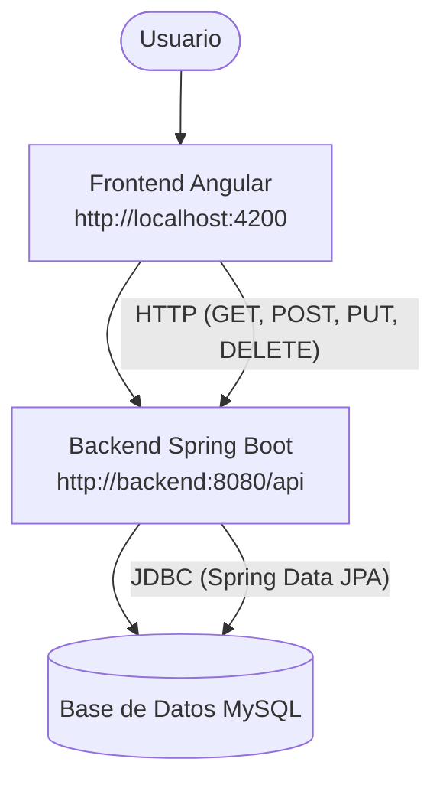

# 📝 Enunciado – App Fullstack con **Java Spring Boot + Angular + MySQL + Docker**

Se solicita desarrollar una **aplicación fullstack** que gestione un catálogo de productos utilizando:

* **Backend**: Java Spring Boot (API REST).
* **Frontend**: Angular (ejecutado con `ng serve`).
* **Base de datos**: MySQL.
* **Contenedores**: Docker para cada servicio (frontend, backend y base de datos).
* **Orquestación**: Docker Compose, con todos los servicios corriendo en la **misma red** para permitir la comunicación.

---

## ✅ Requerimientos funcionales

1. **Gestión de productos**

   * Cada producto tendrá: `id`, `nombre`, `descripción`, `precio`, `stock`.
   * Operaciones requeridas:

     * Listar productos.
     * Crear un nuevo producto.
     * Editar un producto existente.
     * Eliminar un producto.

2. **Frontend (Angular)**

   * Página principal con una tabla que muestre todos los productos desde la API.
   * Formulario para agregar un nuevo producto.
   * Opción de editar y eliminar productos directamente desde la tabla.
   * Uso de **Angular Material** para mejorar la interfaz.
   * El frontend se debe levantar en un contenedor Docker usando `ng serve` (sin Nginx).

3. **Backend (Spring Boot)**

   * API REST con endpoints:

     * `GET /api/productos` → listar productos.
     * `POST /api/productos` → crear producto.
     * `PUT /api/productos/{id}` → actualizar producto.
     * `DELETE /api/productos/{id}` → eliminar producto.
   * Conexión a **MySQL** mediante **Spring Data JPA**.

4. **Base de datos (MySQL)**

   * Se debe crear la tabla `productos` automáticamente a partir de las entidades del backend.
   * Los datos iniciales pueden cargarse con un `data.sql`.

---

## ✅ Requerimientos técnicos

1. **Dockerización individual**

   * Crear un `Dockerfile` para el backend (Spring Boot).
   * Crear un `Dockerfile` para el frontend (Angular con `ng serve`).
   * Usar la imagen oficial de **MySQL** con volúmenes persistentes.

2. **Orquestación con Docker Compose**

   * Todos los servicios deben estar en la **misma red interna**.
   * Servicios requeridos:

     * `frontend` (Angular con `ng serve`, expuesto en el puerto `4200`).
     * `backend` (Spring Boot, expuesto en el puerto `8080`).
     * `db` (MySQL, expuesto en el puerto `3306`).
   * Variables de entorno configuradas en el `docker-compose.yml` (puertos, credenciales de MySQL, etc.).

3. **Accesibilidad**

   * El frontend debe poder acceder al backend usando el nombre del servicio definido en `docker-compose.yml` (por ejemplo `http://backend:8080/api`).
   * El backend debe conectarse a la base de datos usando el nombre del servicio `db`.
   * El usuario debe poder ingresar desde el navegador a `http://localhost:4200` y utilizar la app.

---

## 📊 Diagramas de apoyo

### Arquitectura general

---

---

📦 **Entrega esperada**:

* Carpeta del proyecto con:

  * Código del frontend (Angular).
  * Código del backend (Spring Boot).
  * Configuración de base de datos.
  * Archivos `Dockerfile` para cada servicio.
  * Archivo `docker-compose.yml`.
* Al ejecutar `docker compose up -d`, deben levantarse los **3 contenedores** conectados entre sí, con la aplicación funcionando end-to-end.

---
